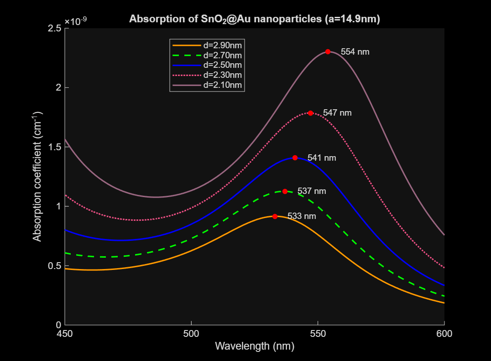

# Absorption Simulation
This is a program that simulates the wavelength-dependent absorption coefficient (alpha) for core-shell nanoparticles.
The inputs are the core size (b) and shell thickness (d).
The outputs are the absorption coefficient at each wavelength.
The simulation is adapted from the Absorption Simulation function by written Kenzie Lewis and Raaja Rajeshwari Manickam, which is based off the algorithm by Dani et al. [1]
If the absorption peak wavelength is known, this simulation can be used to estimate b and d by brute-force curve-fitting.

## Before running the function
Edit the Absorption Simulation file to suit your needs. 
Make sure the fitted parameters (for the core - SnO2 or Fe2O3 - and Au) are up to date with the most recent experimental data.
Comment out the parameters for the type of core that's not of interest (either SnO2 or Fe2O3). Comment out the dielectric function of the effective medium that's not being used (either water or air).
All the units are SI except the absorption coefficient (cm^-1) and the angles are in radians.

## Running the simulation
Run the function in the Plot Absorption Simulation file. This script runs the function and formats the outputs in into a plot. There are three different methods to plot the outputs, as well as an option to plot wavelength-depenedent absorbance derived from the absorption coefficients. The first method examines the effect of a fixed b, but varying d on alpha. The second method holds d constant while varying b. The third method has the particle radius (a) where a = b + d at a fixed value, while varying b and d. Depending on the desired method, be sure to comment out the irrelevant parts. 
   

# References
[1] R.K. Dani, H. Wang, S.H. Bossmann, G. Wysin, and V. Chikan, “Supplemental Material for "Faraday rotation enhancement of gold coated Fe2O3 nanoparticles: Comparison of experiment and theory," ” J. Chem. Phys. 135(22), 224502 (2011). \
[2] A. Ibrahim, “Synthesis and Characterization of Magnetic Nanoparticles to Incorporate into Silicon Waveguides to be Used as Optical Isolators,” M.S. thesis, Eng. Phys., McMaster Univ., Hamilton, Ontario, 2019. [Online]. Available: https://macsphere.mcmaster.ca/bitstream/11375/24720/2/Ibrahim_Amr_E_201908_MASc.pdf 
