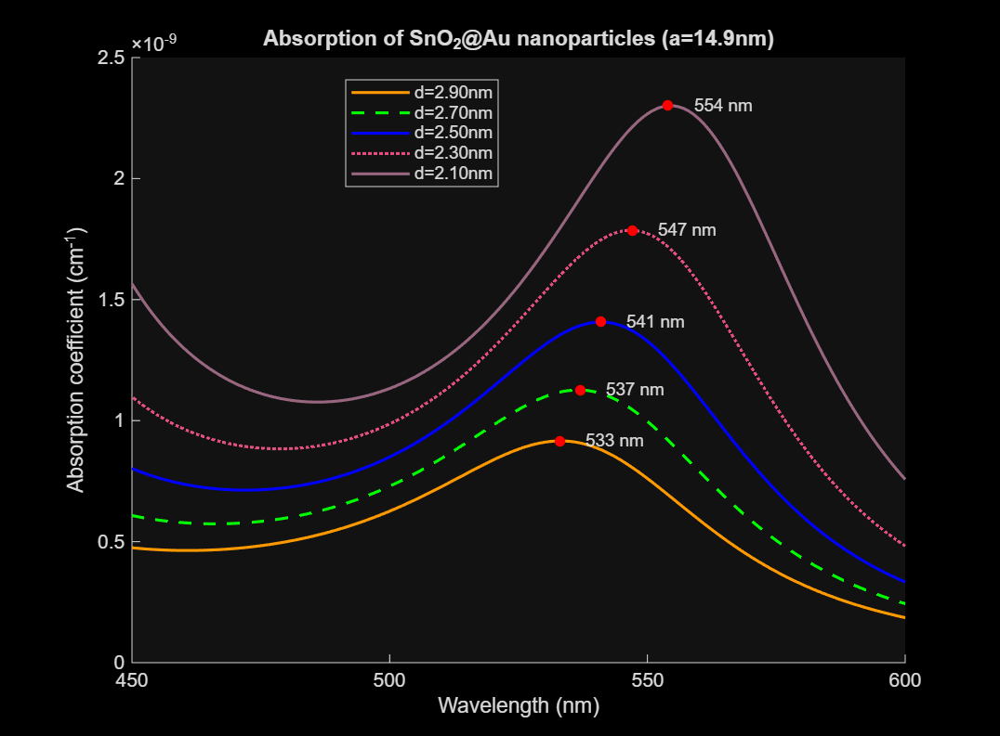

# Absorption Simulation
This is a program that simulates the wavelength-dependent absorption coefficient (alpha) for core-shell nanoparticles.
The inputs are the core size (b) [nm], shell thickness (d) [nm], the planar number density [1/m^2], the core material, the dielectric permittivity of the medium in which the nanoparticles are immersed, the range of wavelengths, and the option of whether to display the alpha values in the command window or not.
The outputs are the absorption coefficient at each wavelength.
The simulation is adapted from the Absorption Simulation function by written Kenzie Lewis and Raaja Rajeshwari Manickam, which is based off the algorithm by Dani et al. [1]
If the absorption peak wavelength is known, this simulation can be used to estimate b and d by fitting the simulated absorption coefficient spectra to the experimental UV-Vis data.

## Before running the function
Make sure the fitted parameters (for the core - SnO2, Fe2O3, or other - and the Au shell) are up to date with the most recent experimental data. 
All the units are SI except the absorption coefficient [cm^-1].

## Running the simulation
Run the function in the Get_Absorption file, a script that formats the outputs in into a plot. There are three different methods to simulate the absorption spectrum, as well as an option to plot wavelength-dependent absorbance derived from the absorption coefficients. The first method examines the effect of a fixed b, but varying d, on alpha. The second method holds d constant while varying b. The third method has the particle radius (a) where a = b + d at a fixed value, while varying b and d. The user can choose which method they desire to use.
   

# References
[1] R.K. Dani, H. Wang, S.H. Bossmann, G. Wysin, and V. Chikan, “Supplemental Material for "Faraday rotation enhancement of gold coated Fe2O3 nanoparticles: Comparison of experiment and theory," ” J. Chem. Phys. 135(22), 224502 (2011). \
[2] A. Ibrahim, “Synthesis and Characterization of Magnetic Nanoparticles to Incorporate into Silicon Waveguides to be Used as Optical Isolators,” M.S. thesis, Eng. Phys., McMaster Univ., Hamilton, Ontario, 2019. [Online]. Available: https://macsphere.mcmaster.ca/bitstream/11375/24720/2/Ibrahim_Amr_E_201908_MASc.pdf 
